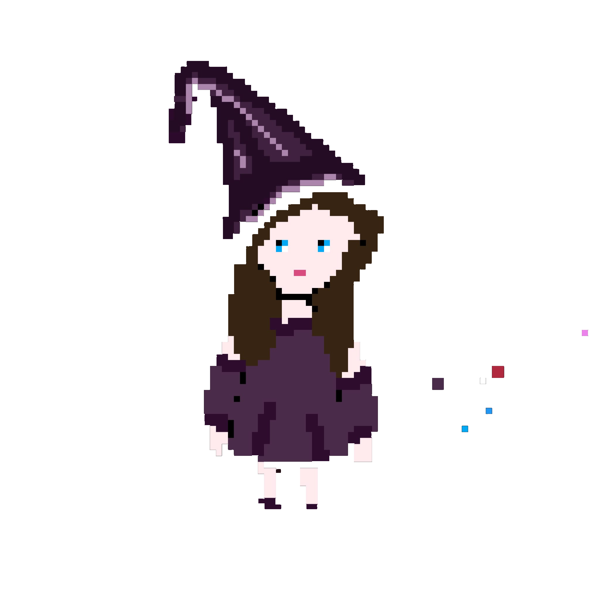
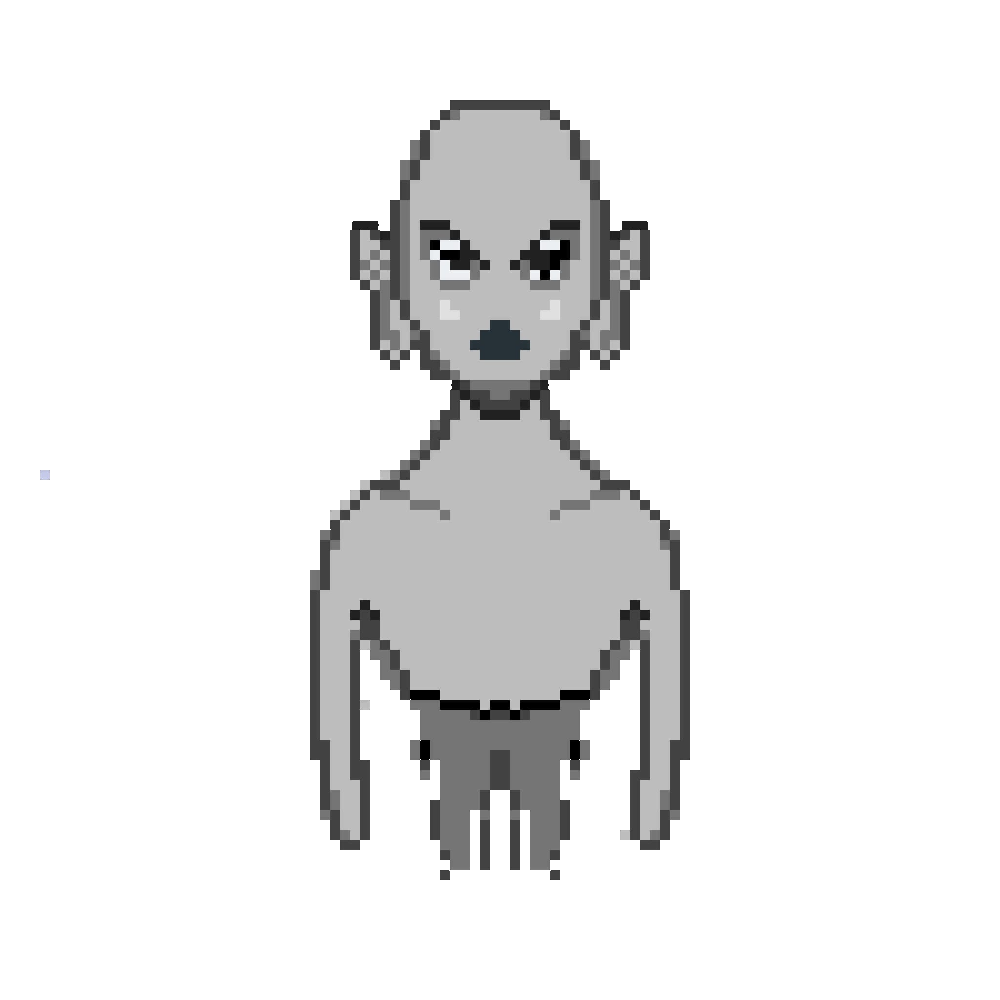
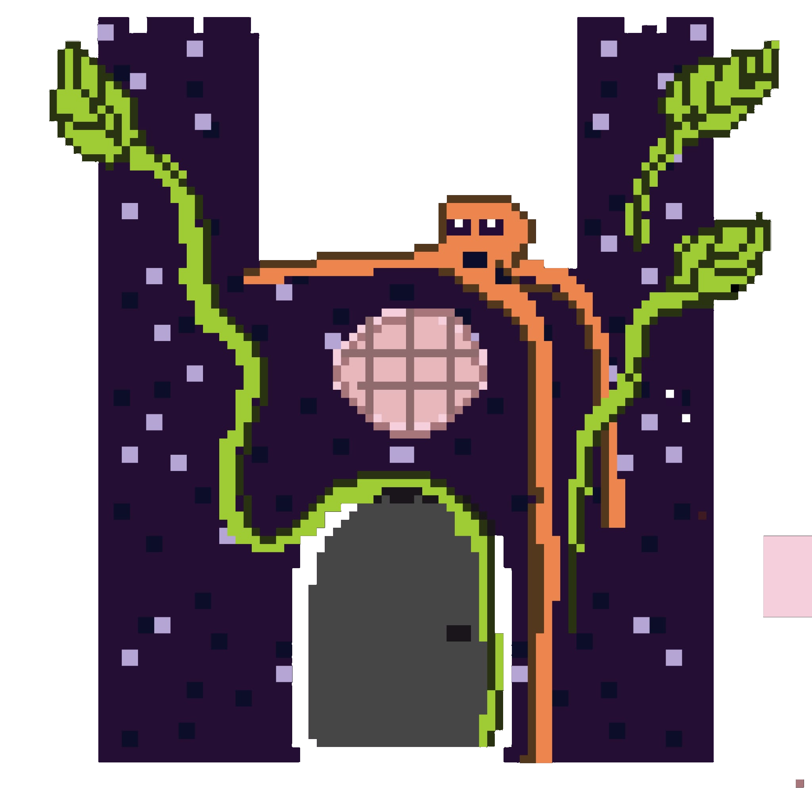
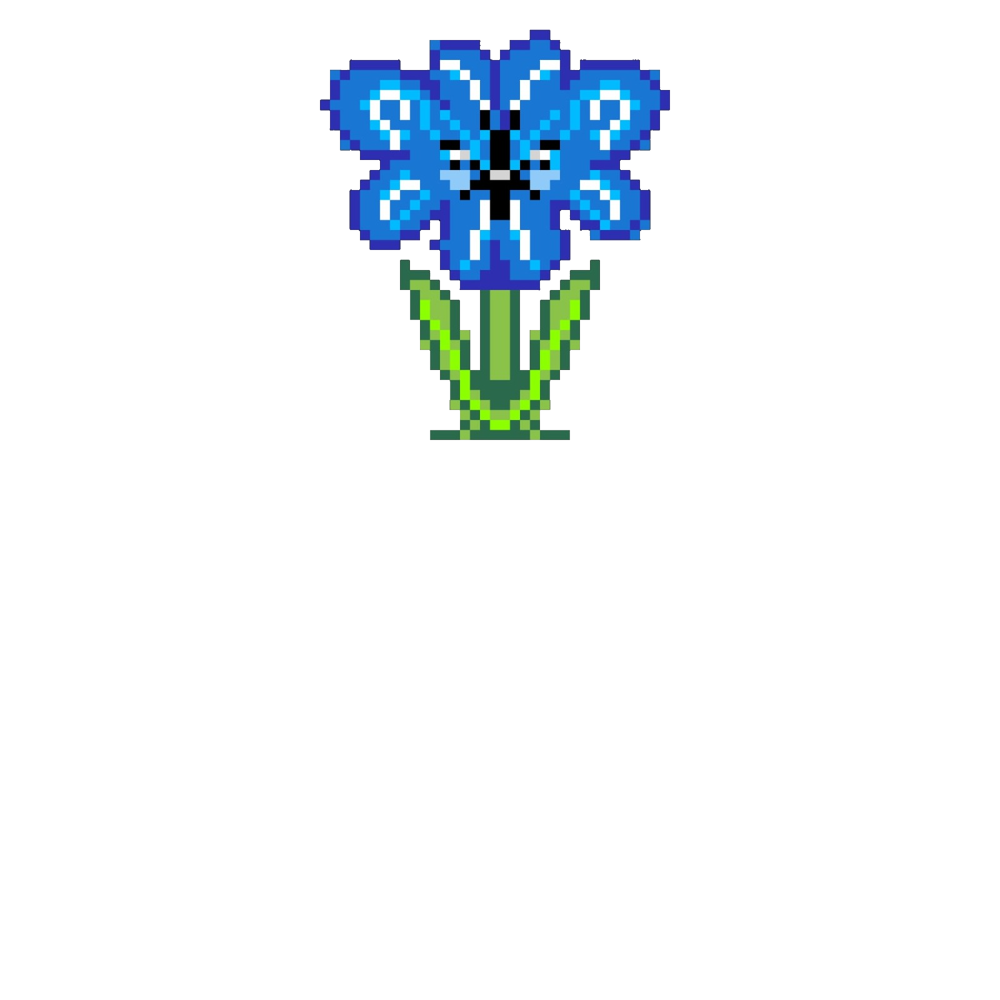
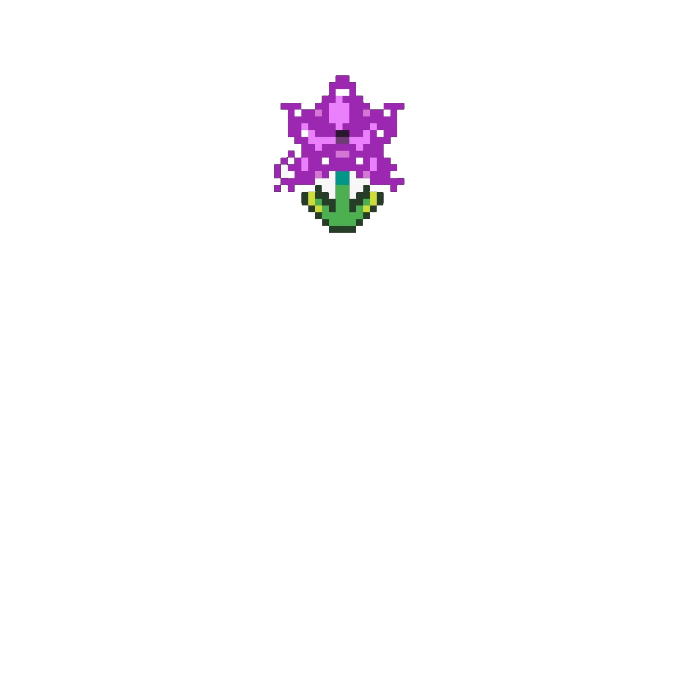
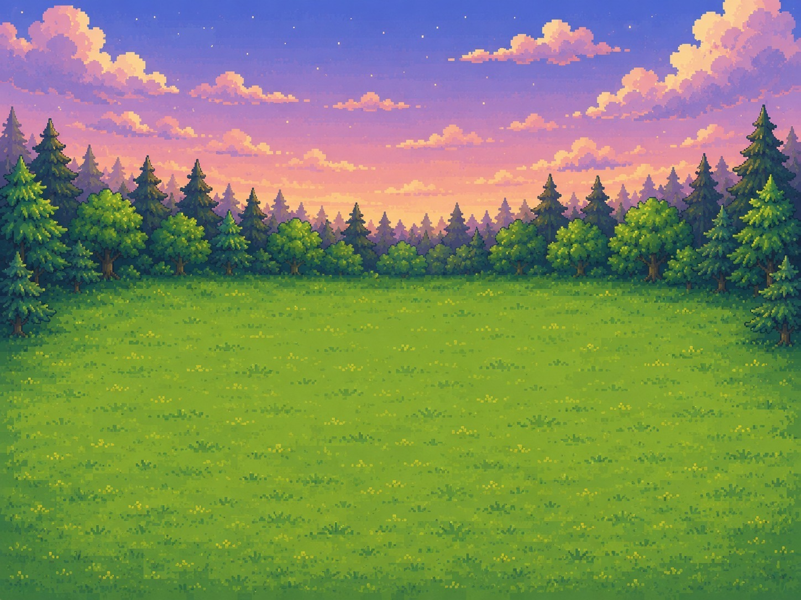
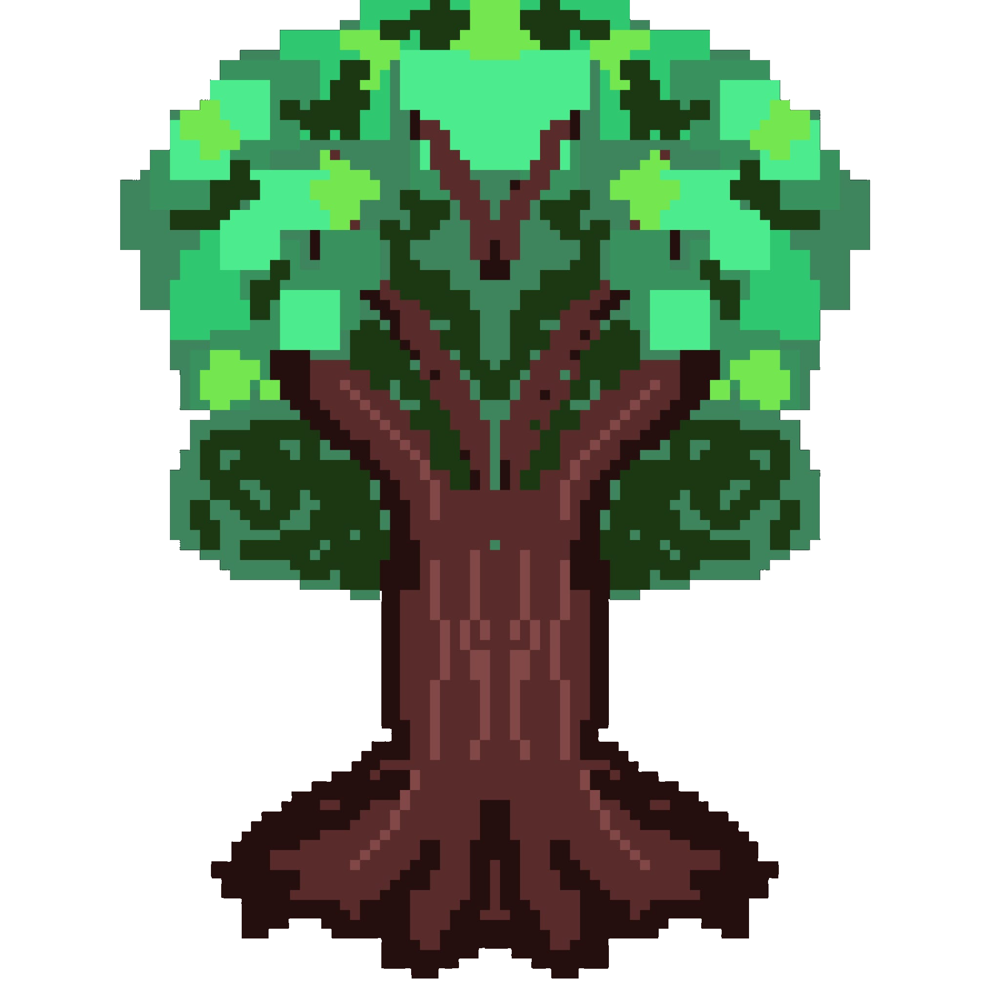
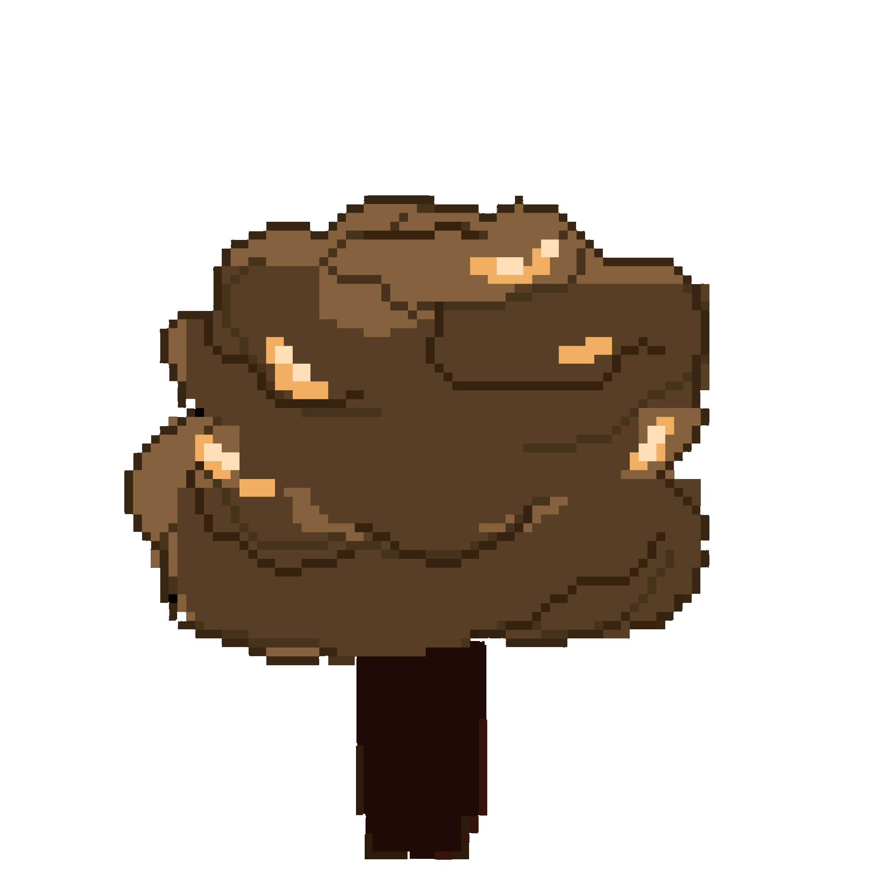
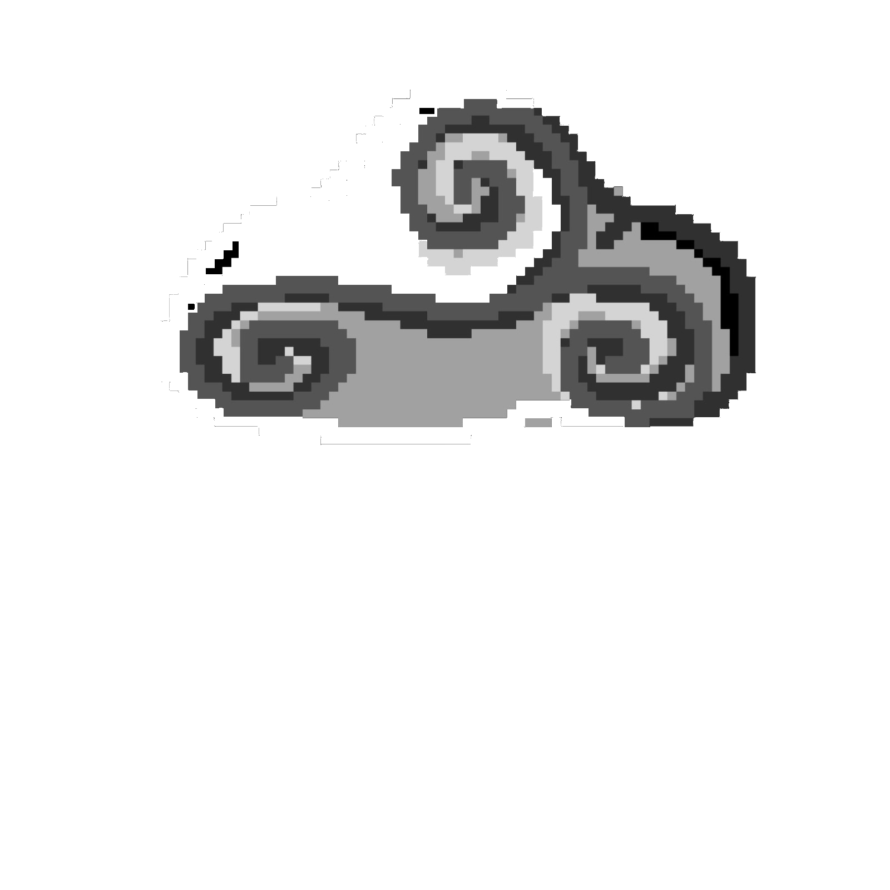
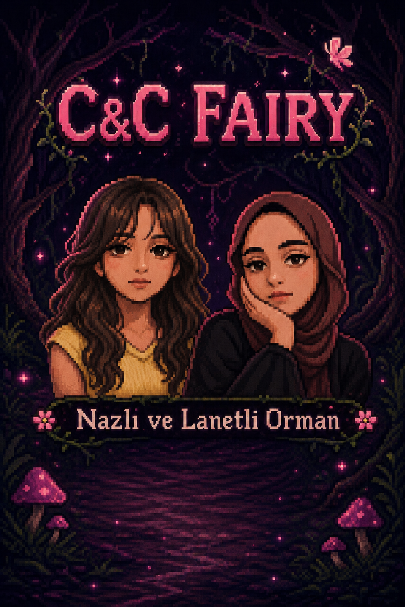

# Nazli'nin Cicek Bahcesi - Game Design Document

## 1. Oyun Ozeti

**Oyun adi:** Nazli'nin Cicek Bahcesi  
**Tur:** 2D yandan gorunumlu mobil/macera oyunu  
**Platform:** Android, Flutter Web/Desktop test ortami  
**Motor/Teknoloji:** Flutter + Flame  
**Hedef kitle:** Cocuklar ve basit, sevimli mobil oyun seven oyuncular  

Nazli, buyulu bir cicek bahcesinde ilerleyen kucuk bir peri/prenses karakteridir. Oyuncu Nazli'yi yonlendirerek cicek toplar, engellerden kacar, canavar ve cadinin buyulerinden korunur. Kelebek ve sihirli agac gibi yardimci ogeler oyuncuya cadinin buyu atmasini gecici olarak durdurma gucu verir. Amac, canlar bitmeden bolum sonundaki eve ulasmaktir.

## 2. Tasarim Hedefleri

- Basit ve anlasilir kontrol sistemi sunmak.
- Oyuncuya surekli hareket, toplama ve kacinma hissi vermek.
- Cocuk dostu, renkli ve masalsi bir atmosfer yaratmak.
- Kisa oyun donguleriyle mobilde kolay oynanabilir olmak.
- Tehlike ve yardimci ogeler arasinda dengeli bir risk-odul sistemi kurmak.

## 3. Temel Oyun Dongusu

1. Oyuncu Nazli'yi haritada hareket ettirir.
2. Cicekleri toplayarak skor kazanir.
3. Diken, yagmur, canavar ve cadinin mor buyusunden kacar.
4. Kelebege dokunursa iksir ortaya cikar.
5. Iksiri alirsa cadi 5 saniye buyu atamaz.
6. Sihirli agaca dokunursa Nazli 10 saniye boyunca sihir atabilir.
7. Nazli'nin sihri cadiya carparsa cadi 5 saniye buyu atamaz.
8. Can bitmeden eve ulasirsa oyuncu kazanir.
9. Can 0 olursa Nazli sato tarafina cekilir ve game over ekrani acilir.

## 4. Oyuncu Karakteri

**Karakter:** Nazli  
**Rol:** Oyuncunun kontrol ettigi ana karakter  
**Gorsel stil:** Piksel-art prenses/peri  
**Boyut:** Cadi ve canavar ile ayni temel gorsel boyutta tutulur.  

### Hareket

- Klavye: W/A/S/D veya yon tuslari
- Mobil: Ekran altindaki yon butonlari
- Surukleme: Flame drag kontrolu ile pozisyon degistirme

### Yetenek

Nazli normalde buyu atamaz. Sihirli agaca temas ettiginde 10 saniyelik sihir gucu kazanir. Bu sure boyunca:

- Space ile sihir atabilir.
- Mobilde sihir butonu ile sihir atabilir.
- Sihir atisinda kisa cooldown vardir.
- Sihir cadiya carparsa cadi 5 saniye buyu atamaz.

## 5. Can Sistemi

**Baslangic cani:** 10  
**HUD:** Sag ustte kalp ikonlariyla gosterilir.  

Can azaltan olaylar:

- Cadinin mor buyusu Nazli'ya carparsa 1 can azalir.
- Yagmur damlasina temas ederse 1 can azalir.
- Canavara temas ederse 1 can azalir.
- Dikene temas ederse 1 can azalir.

Surekli temas hasarlarinda kisa hasar bekleme suresi kullanilir. Boylece tek temasla tum canlar bir anda bitmez.

Can 0 olursa oyun kaybedilir. Kaybetme durumunda Nazli bir anda isinlanmaz; sato tarafina dogru hareket efektiyle cekilir ve ardindan sonuc ekrani acilir.

## 6. Dusmanlar ve Tehlikeler

### Cadi

Cadinin gorevi Nazli'yi takip etmek ve mor buyu firlatmaktir.

Davranis:

- Nazli'ye dogru hareket eder.
- Belirli mesafede durur.
- Belirli araliklarla Nazli'nin konumuna mor buyu atar.
- Iksir veya Nazli'nin sihri ile 5 saniye boyunca buyu atamaz.

Ortak susturma fonksiyonu:

```dart
disableSpellCastingFor(Duration duration)
```

Bu sistem hem iksir hem de agac sihri tarafindan kullanilir.

### Canavar

Canavarlar haritada hareket eden dusmanlardir.

- Nazli'ya temas edince direkt game over yapmaz.
- Sadece 1 can azaltir.
- Hasar cooldown'u sayesinde ayni temasta canlar hizla bitmez.

### Diken

Haritaya yerlestirilmis sabit engellerdir.

- Nazli temas ederse 1 can azalir.
- Cooldown ile tekrar hasar verir.

### Kara Bulut ve Yagmur

Kara bulut harita uzerinde hareket eder ve yagmur damlalari birakir.

- Yagmur damlasi Nazli'ya degince 1 can azaltir.
- Her damlanin arka arkaya can eksiltmemesi icin hasar bekleme suresi kullanilir.

## 7. Yardimci Ogeler

### Cicekler

Cicekler toplanabilir skor objeleridir.

- Farkli renk turleri vardir: pembe, mavi, mor.
- Nazli cicege temas edince cicek sahneden kalkar.
- Skor 1 artar.

### Kelebek

Kelebek iksir mekanigini baslatan yardimci objedir.

- Nazli kelebege temas edince kelebek kaybolur.
- Iksir Nazli'nin erisebilecegi, kamera icinde bir konumda belirir.
- Kelebegin carpisma alani oyuncunun yakalamasini kolaylastirmak icin genis tutulur.

### Iksir

Iksir kelebege temas ettikten sonra ortaya cikar.

- Baslangicta gizlidir.
- Kelebek yakalaninca fade-in ile gorunur olur.
- Ilk gorundugu anda hemen toplanamaz; kisa toplanabilir gecikmesi vardir.
- Nazli iksire temas edince cadi 5 saniye buyu atamaz.
- Iksir kullanildiktan sonra sahneden silinir.

### Sihirli Agac

Sihirli agac Nazli'ya gecici sihir gucu verir.

- Nazli agaca temas edince 10 saniye sihir kullanabilir.
- Agacin tekrar guc verebilmesi icin cooldown vardir.
- Nazli'nin attigi sihir cadiya carparsa cadi 5 saniye buyu atamaz.

## 8. Kazanma ve Kaybetme Kosullari

### Kazanma

Nazli haritanin sonundaki eve ulasirsa oyun kazanilir. Sonuc ekraninda toplanan cicek sayisi gosterilir.

### Kaybetme

Nazli'nin cani 0 olursa oyun kaybedilir.

Kaybetme akisi:

1. Oyun bitis durumu baslar.
2. Mor buyuler temizlenir.
3. Nazli sato tarafina dogru hareket efektiyle cekilir.
4. Kisa animasyon sonrasinda sonuc ekrani acilir.

## 9. UI / HUD

### Skor Paneli

Sol ustte toplanan cicek sayisini gosterir.

### Can Paneli

Sag ustte 10 kalp ile Nazli'nin canini gosterir.

- Dolu kalp: mevcut can
- Bos kalp: kaybedilmis can
- Kalpler kompakt bir duzende sarilir.

### Mobil Kontroller

Ekran altinda hareket butonlari bulunur:

- Sol
- Sag
- Yukari
- Asagi
- Sihir butonu

Sihir butonu yalnizca Nazli sihir gucu aldiginda etkili olur.

## 10. Kamera ve Harita

Oyun dunyasi gorunen ekranin birkac kati genisligindedir. Kamera Nazli'yi yatay eksende takip eder. Oyuncu haritanin basindan sonundaki eve dogru ilerler.

Harita ogeleri:

- Baslangicta cadi satosu
- Orta bolumlerde cicekler, dikenler, agaclar, canavarlar, kelebek ve iksir
- Harita sonunda ev

## 11. Gorsel Stil

Oyun piksel-art ve masalsi bir atmosfer kullanir.

Ana gorsel ogeler:

- Renkli dogal arka plan
- Piksel-art Nazli
- Cadi ve cadi satosu
- Canavar/hayalet
- Buyulu agaclar
- Parlak cicekler
- Mor cadı buyusu
- Lila/pembe Nazli sihri
- Kalp temali can paneli

## 12. Gorsel Varliklar

Bu bolum oyunda kullanilan temel gorselleri ve oyun icindeki rollerini listeler.

### Ana Karakterler ve Dusmanlar

| Varlik | Gorsel | Oyun Icindeki Rol |
| --- | --- | --- |
| Nazli |  | Oyuncunun kontrol ettigi ana karakter |
| Cadi |  | Nazli'yi takip eden ve mor buyu atan dusman |
| Canavar / Hayalet |  | Temas edince 1 can azaltan hareketli dusman |
| Cadi Satosu |  | Baslangic bolgesi ve kaybetme animasyonu hedefi |

### Toplanabilir ve Yardimci Ogeler

| Varlik | Gorsel | Oyun Icindeki Rol |
| --- | --- | --- |
| Pembe Cicek |  | Skor kazandiran toplanabilir cicek |
| Mavi Cicek |  | Skor kazandiran toplanabilir cicek |
| Mor Cicek |  | Skor kazandiran toplanabilir cicek |
| Kelebek |  | Yakalaninca iksiri ortaya cikarir |
| Iksir |  | Nazli alinca cadinin buyu atmasini 5 saniye durdurur |
| Kalp |  | Can panelinde dolu cani temsil eder |

### Cevre ve Engel Gorselleri

| Varlik | Gorsel | Oyun Icindeki Rol |
| --- | --- | --- |
| Arka Plan |  | Oyun dunyasinin ana masalsi bahce zemini |
| Agac 1 |  | Nazli'ya 10 saniyelik sihir gucu veren agac |
| Agac 2 |  | Nazli'ya 10 saniyelik sihir gucu veren agac |
| Diken |  | Temas edince can azaltan sabit engel |
| Kara Bulut |  | Yagmur damlasi olusturan hareketli tehlike |
| Ev |  | Nazli ulasinca kazanma kosulunu tamamlayan hedef |

### Ekip / Ekstra Gorsel

| Varlik | Gorsel | Not |
| --- | --- | --- |
| Ekip Fotografi |  | Menu, tanitim veya ekip ekrani icin kullanilabilir |

## 13. Ses ve Muzik Hedefleri

Mevcut projede ses sistemi bulunmuyorsa ileride eklenebilecek sesler:

- Cicek toplama sesi
- Hasar alma sesi
- Iksir alma sesi
- Sihir atma sesi
- Cadinin buyu firlatma sesi
- Kazanma/kaybetme jingle'i
- Hafif masalsi arka plan muzigi

## 14. Teknik Tasarim

### Motor

- Flutter
- Flame

### Temel Componentler

- `NazliComponent`
- `CadiComponent`
- `BuyuComponent`
- `NazliBuyuComponent`
- `CanavarComponent`
- `CicekComponent`
- `DikenComponent`
- `AgacComponent`
- `KelebekComponent`
- `IksirComponent`
- `YagmurDamlasiComponent`
- `KaraBulutComponent`
- `EvComponent`
- `CadiSatosuComponent`

### Veri Modeli

- `OyunSkoru`
  - Toplanan cicek sayisi
  - Kalan can
  - Baslangic cani

### Collision Yaklasimi

Projede Flame componentleri uzerinden `Rect` tabanli carpisma kontrolleri kullanilir. Hareketli mermi ve damla gibi objelerde world uzerinden aktif component taramasi tercih edilir; boylece mount zamanlamasi nedeniyle liste disina dusen objeler hasar kontrolunu kacirmaz.

## 15. Denge Ayarlari

Mevcut denge degerleri:

- Baslangic cani: 10
- Sihirli agac gucu: 10 saniye
- Cadinin susturulma suresi: 5 saniye
- Hasar bekleme suresi: yaklasik 1 saniye
- Nazli sihir atis cooldown'u: 0.5 saniye
- Iksir toplanabilir gecikmesi: kisa fade-in suresi

Gelecekte ayarlanabilecek noktalar:

- Cadinin buyu atma araligi
- Canavar hizi
- Yagmur damlasi sikligi
- Cicek sayisi
- Harita uzunlugu
- Agac cooldown suresi

## 16. Gelecek Gelistirme Fikirleri

- Bolum sistemi
- Farkli cadi tipleri
- Daha fazla iksir cesidi
- Sureli gorevler
- Toplanan ciceklerle kostum acma
- Ses efektleri ve muzik
- Basit animasyonlu sprite sheet sistemi
- Ana menuye ayarlar ekrani
- Zorluk secenekleri

## 17. Basari Kriterleri

Oyun su kosullari sagladiginda temel tasarim hedeflerine ulasmis sayilir:

- Oyuncu Nazli'yi rahatca kontrol edebilir.
- Cicek toplama ve skor sistemi calisir.
- Cadinin buyusu, yagmur, diken ve canavar hasar sistemi tutarli calisir.
- Iksir ve agac sihri cadinin buyusunu gecici olarak durdurur.
- Can sistemi anlasilir ve ekranda net gorunur.
- Kazanma ve kaybetme ekranlari dogru zamanda acilir.
- Mobil cihazda oyun akici ve anlasilir oynanir.
